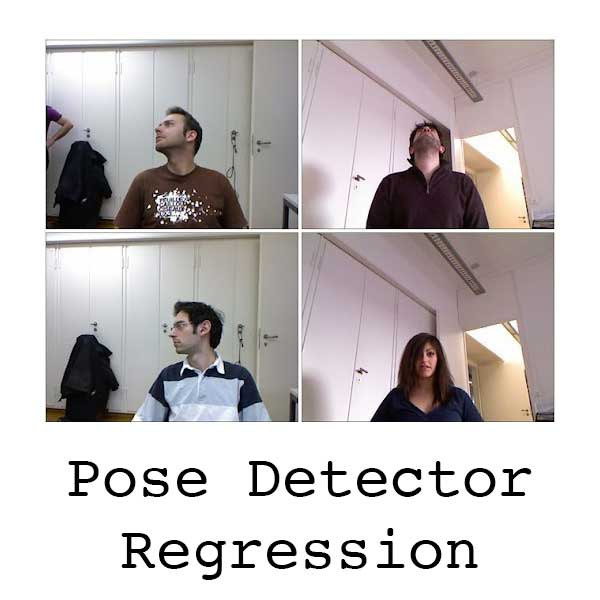

<div align="center">


**The lightweight app to run your AI models. Use this app, so you don't have to build your own.**
<br>
<p align="center">
  <a href="https://yhat.pub/">Website</a> •
  <a href="#key-features">Key Features</a> •
  <a href="#how-to-use">Quick Start</a> •
  <a href="#examples">Fast.ai Examples</a>
</p>

[](https://discord.gg/e37qeAGv)
[](https://www.apache.org/licenses/LICENSE-2.0)
  
</div>

______________________________________________________________________


### YHat.pub Design Philosophy

- Familiar tools (Colab, Github).
- Minimal code. (Write a predict function with python decorators)
- Turn that predict function into a webapp, hosted at <a href="https://yhat.pub">YHat.pub</a>.
- Make the webapp so easy, a panda could use it.
<p float="center">
  
  
  
      
</p>

______________________________________________________________________

### Try it out

###### Click on a link below to try any of these examples from Fastai

<p float="center">
  <a href="https://www.yhat.pub/model/6aabd372-f61e-4202-824a-fa0edff1f61f/run_model/6aabd372-f61e-4202-824a-fa0edff1f61f" target="_blank" >
    
  </a>
  &nbsp;
  <a href="https://www.yhat.pub/model/a153c6a6-597a-41ce-8e18-362a7693cda3/run_model/a153c6a6-597a-41ce-8e18-362a7693cda3" target="_blank" >
    
  </a>
  &nbsp;
  <a href="https://www.yhat.pub/model/fa228f32-d8dd-4d41-9648-d84d3fcf1148/run_model/fa228f32-d8dd-4d41-9648-d84d3fcf1148" target="_blank" >
    
  </a>
</p>

______________________________________________________________________

### Need help?
Hop in Discord and ask whatever you like
<br>
[](https://discord.gg/e37qeAGv)
______________________________________________________________________

### A Little Example 

#### Step 1: Install

Open a Google colab and install dependencies
```
!pip install -q --no-cache-dir git+https://github.com/yhatpub/yhat_params.git@main
```

#### Step 2: Write Predict Function

```
from yhat_params.yhat_tools import inference_test, FieldType, inference_predict
from PIL import ImageFilter

input = {"text": FieldType.Text, "image": FieldType.PIL}
output = {"text": FieldType.Text, "image": FieldType.PIL}

@inference_predict(input=input, output=output)
def predict(params):
    text = f"hello world {params['text']}"
    image = params['image'].convert("RGB")
    image = image.filter(ImageFilter.EMBOSS)
    return {"text": text, "image": image}
```
#### Step 3: Test your code

```
from yhat_params.yhat_tools import in_colab
from PIL import Image
import torch

if in_colab():
    torch.hub.download_url_to_file('https://upload.wikimedia.org/wikipedia/en/4/48/Blank.JPG', '1x1.jpg')
    img = Image.open('1x1.jpg')  
    inference_test(predict_func=predict, params={'text': 'my text', 'image': img})
```

#### Step 4: Commit to Github and run on YHat.pub

Go to <a href="https://YHat.pub">YHat.pub</a> and upload your model and run!
______________________________________________________________________


### A Bigger Example

This example is the teddy bear detector (lesson 2) from <a href="http://fast.ai">fast.ai</a>. The entire notebook is here <a href="https://github.com/yhatpub/yhatpub/blob/notebook/notebooks/fastai/lesson2.ipynb">Colab notebook</a>. Feel free to start a new colab notebook and follow along.

#### Step 1: Upload your model

Train your model and upload it for public accessibility. This example uses Google Drive, but anywhere is fine.
<br>
<br>
<p float="center">
  
</p>

#### Step 2: Do your Pip installs.

______________________________________________________________________

The following cell installs pytorch, fastai and yhat_params, which is used to decorate your `predict` function.

```bash
!pip install -q --upgrade --no-cache-dir fastai
!pip install -Uqq --no-cache-dir git+https://github.com/yhatpub/yhat_params.git@main
```

#### Step 3: Download your model

Google drive does not allow direct downloads for files over 100MB, so you'll need to follow the snippet below to get the download url. .

```bash
#file copied from google drive
google_drive_url = "Add url to google drive model here or use this" # https://drive.google.com/file/d/1s-fQPvk8l7CTUiiRvKzecijSluDnoZ27/view?usp=sharing
import os
os.environ['GOOGLE_FILE_ID'] = google_drive_url.split('/')[5]
os.environ['GDRIVE_URL'] = f'https://docs.google.com/uc?export=download&id={os.environ["GOOGLE_FILE_ID"]}'
!echo "This is the Google drive download url $GDRIVE_URL"
```

`wget` it from google drive. This script places the model in a `model` folder
```bash
!wget -q --no-check-certificate $GDRIVE_URL -r -A 'uc*' -e robots=off -nd
!mkdir -p model
!mv $(ls -S uc* | head -1) ./model/export.pkl
```
verify the model exists. **Warning** YHat is pretty finicky about where you place your models. Make sure you create a `model` directory and download your model(s) there  

```bash
!ls -l ./model/export.pkl
```

#### Step 4: Load and Run Learner

The following is the equivalent of torch `torch.load` or ts `model.load_weights`

```bash
from fastai.vision.all import *
learn_inf = load_learner('./model/export.pkl')
```

And write your predict function. Note, you will need to decorate your function with <a href="https://github.com/yhatpub/yhat_params">inference_predict</a> which takes 2 parameters, a `input` and `output`.

These parameters are how YHat.pub maps your predict functions `input`/`output` of the web interface. The key, in this case, `image` or `text` is how you access the variable and the value is it's type, in this case, `FieldType.PIL` or `FieldType.Text`.

```bash
input = {"image": FieldType.PIL} # PIL image
output = {"text": FieldType.Text} # str 

@inference_predict(input=input, output=output)
def predict(params):
    img = PILImage.create(np.array(params["image"].convert("RGB")))
    result = learn_inf.predict(img)
    return {"text": str(result[0])}
```

#### Step 5: Test your function

For testing, first, import `in_colab` since you only want to run this test in colab. YHat will turn this colab in an imported script, so you want to tell YHat not to run this test outside of colab. Next, import `inference_test` which is a function to make sure your `predict` will run ok with YHat.

Now, inside `in_colab()` , first get whatever test data you'll need, in this case, an image. Then you'll call your predict function, wrapped inside `inference_test`, passing in the same params you defined above. If something is missing, you should see an informative error. Otherwise, you'll see something like
`Please take a look and verify the results`

```bash
from yhat_params.yhat_tools import in_colab, inference_test

if in_colab():
    import urllib.request
    from PIL import Image
    urllib.request.urlretrieve("https://upload.wikimedia.org/wikipedia/commons/thumb/a/a9/GrizzlyBearJeanBeaufort.jpg/220px-GrizzlyBearJeanBeaufort.jpg", "input_image.jpg")
    img = Image.open("input_image.jpg")
    inference_test(predict_func=predict, params={'image': img})
```

If you run into errors, feel free to hop into Discord. 
<br>
[](https://discord.gg/e37qeAGv)

#### Step 6: Upload to Github

Otherwise, you'll now want to clear your outputs and save a public repo on Github.

<p float="center">
  
</p>

#### Step 7: Sign into YHat.pub and start your build.
If it doesn't work, make sure to look out for errros. Click the EXPORT button to download the logs.

<p float="center">
  
</p>

